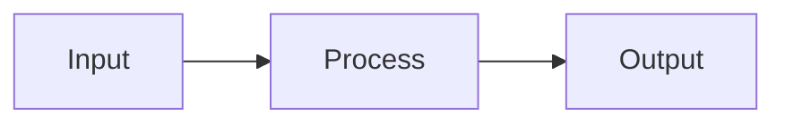

# seesharp.ch

Personal landing page + blog for Fabio Salvalai, built with Jekyll + GitHub Pages.

## Local preview

```
docker compose up
```

Open `http://localhost:4000`. Changes to markdown and data files reload automatically. `_config.yml` changes require restarting the container.

Drafts are visible locally but not in production.

## Updating content

| What | Where |
|------|-------|
| Bio text | `index.md` |
| Projects | `_data/projects.yml` |
| CV | `_data/cv.yml` |
| Site metadata (name, tagline, links) | `_config.yml` |

## Blog

### Writing a post

Create a markdown file in `_drafts/`:

```
_drafts/my-post-slug.md
```

With front matter:

```yaml
---
layout: post
title: "My Post Title"
tags: [react, architecture]
---

Content here. Supports **markdown**, `code blocks`, and mermaid diagrams.
```

### Mermaid diagrams

Use fenced code blocks with the `mermaid` language hint:

````

````

### Lazy writing with Claude Code

```
/blog rough notes about what I want to write about
```

Claude writes a full draft in `_drafts/` matching the blog's tone of voice.

### Preview a draft

Drafts are automatically visible on `http://localhost:4000/blog/` when running locally.

### Publishing

Move the file from `_drafts/` to `_posts/` and add the date:

```
mv _drafts/my-post-slug.md _posts/2026-04-01-my-post-slug.md
```

Then commit and push. GitHub Actions builds and deploys automatically.

### Unpublishing

Move the file back to `_drafts/` (remove the date from the filename), commit and push.

## Deployment

Every push to `main` triggers a GitHub Actions workflow that:

1. Builds the Jekyll site
2. Generates the OG image (Puppeteer)
3. Generates the CV PDF (Puppeteer)
4. Deploys to GitHub Pages at `www.seesharp.ch`

## DNS (OVH)

| Record | Type | Target |
|--------|------|--------|
| `@` | A | `185.199.108-111.153` (x4) |
| `www` | CNAME | `salfab.github.io.` |
| `whodunit` | CNAME | `whodunit-party.vercel.app.` |
| `faux-temoignage` | CNAME | `whodunit-party.vercel.app.` |
| `photobooze` | CNAME | `photobooze.vercel.app.` |

## Analytics

[GoatCounter](https://seesharpch.goatcounter.com) — privacy-friendly, no cookies, GDPR-compliant. Configured via `goatcounter` key in `_config.yml`.
