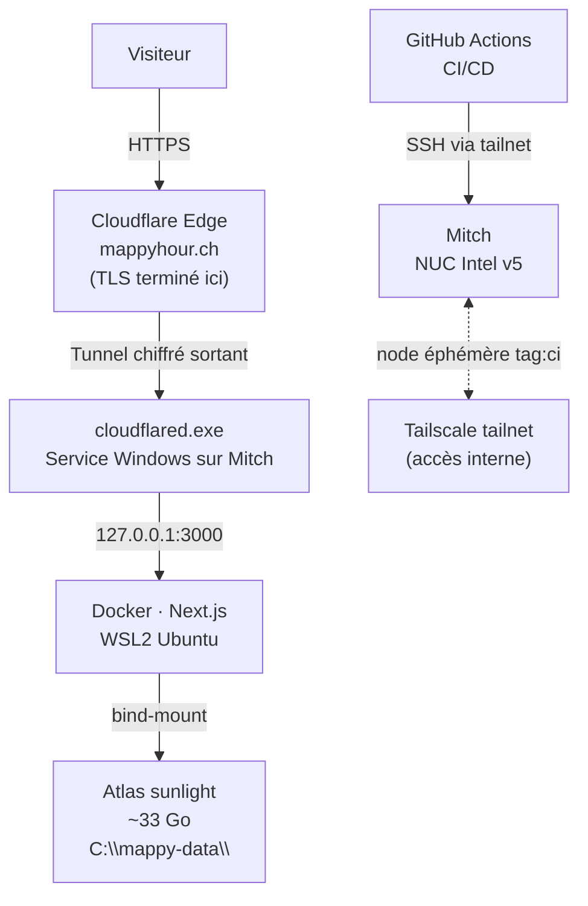

Dans mon bureau, il y a un pavé en alu brossé d'une quinzaine de centimètres de côté. Il s'appelle Mitch. Il tourne 24h/24 en silence total — pas de ventilateur, refroidissement passif — et depuis quelques semaines il répond sur [mappyhour.ch](https://mappyhour.ch) pour quiconque veut savoir quelle terrasse est au soleil à 17h.

Voilà comment on arrive là pour 85 centimes par mois.

## Mitch et son SSD de collection

Un NUC, c'est un mini-PC Intel — "Next Unit of Computing". Compact, peu gourmand en énergie, conçu pour tenir partout. Le mien est une version 5, logé dans un boîtier Cirrus7 : aluminium massif, refroidissement 100% passif, zéro bruit. Quand les Allemands de Cirrus7 me l'ont envoyé par la poste, ils avaient glissé des Haribo dans la boîte. *Sie sind so süß.*

Seize ans d'âge. Il tourne sous Windows 10 — oui, celui dont le support de sécurité s'arrête bientôt. C'est sur la liste. En attendant, il embarque ce qui était alors le tout premier SSD grand public en SATA III : une révolution à l'époque. 118 gigaoctets. En 2026, ça te laisse exactement le temps de finir d'installer Windows pour te retrouver avec 20 Go de libre et une légère angoisse existentielle.

Mais pour faire tourner une app Next.js et servir 33 Go de données géospatiales précalculées, ça tient.

## L'URL moche, puis le vrai domaine

Point de départ : Tailscale Funnel. Tailscale, c'est un outil qui crée un réseau privé entre tes machines — comme si elles étaient toutes branchées sur le même réseau local, peu importe où elles se trouvent physiquement dans le monde. La fonctionnalité Funnel va un cran plus loin : elle expose un port directement sur Internet, avec un certificat TLS géré automatiquement. Résultat : MappyHour tourne publiquement sur `mitch.tail63c42d.ts.net`. Fonctionnel. Pas imprimable sur une carte de visite.

Il me fallait `mappyhour.ch`. J'ai créé un compte Infomaniak sur mon téléphone, acheté le domaine, connecté un compte Cloudflare avec mon GitHub. Puis j'ai généré des clés API à durée de vie d'un jour — Infomaniak d'un côté, Cloudflare de l'autre — et je les ai toutes tendues à Claude avec une instruction simple : rends ce site accessible sur ce domaine, débrouille-toi.

Ce qui a suivi, c'est une délégation totale. Claude a cartographié l'architecture, identifié ce qui était possible et ce qui ne l'était pas, puis tout exécuté par API sans que j'aie à toucher une interface. La première idée — `mappyhour.ch CNAME mitch.tail63c42d.ts.net` — ne pouvait pas fonctionner : le navigateur aurait vu un certificat TLS émis pour `*.tail63c42d.ts.net`, pas pour `mappyhour.ch`. Erreur de cert. Ce n'est pas un bug de Tailscale — c'est une limite structurelle qui n'existe pas pour les hébergeurs classiques, parce que c'est eux qui gèrent le TLS. Quand tu héberges toi-même, c'est ton problème.

La solution : **Cloudflare Tunnel**. `cloudflared` — un petit service — tourne sur Mitch et ouvre une connexion sortante vers l'edge Cloudflare. Pas d'IP publique, pas de port-forwarding sur la box. Cloudflare termine le TLS pour `mappyhour.ch` avec son propre certificat. Gratuit.

Avec les clés API du jour, Claude a tout enchaîné lui-même : transfert des nameservers vers Cloudflare via l'API Infomaniak, création du tunnel Cloudflare, configuration des règles d'ingress, création des CNAME DNS — puis connexion SSH à Mitch pour installer `cloudflared` comme service Windows à démarrage automatique. Moi, j'ai regardé les confirmations défiler.

Vingt minutes de propagation DNS. `mappyhour.ch` répond avec un vrai certificat.

## Comment c'est câblé

Le trafic public ne passe jamais par une IP exposée — il passe par le tunnel Cloudflare. Le CI/CD, lui, passe par Tailscale : le runner GitHub Actions rejoint le réseau privé avec un accès éphémère qui expire à la fin du job.

## Umami, sans cookies ni bannière

Umami est un outil d'analytics open-source, self-hosted. Il tourne dans le même `docker-compose.yml`, avec sa propre base de données. Le tracker est relayé par Next.js sur `/_analytics/*` — les visiteurs ne voient jamais de domaine tiers, pas de cookies, pas de bannière RGPD à cliquer. Setup complet via API depuis un tunnel SSH local, UUID baked dans le bundle au build.

## Ce qu'on rate quand on fait ça seul — et ce que Windows 10 force à ne pas rater

Mitch tourne sous Windows 10, dont le support de sécurité s'arrête bientôt. C'est une contrainte connue, et c'est précisément elle qui m'a poussé à ne jamais exposer la machine directement sur Internet. Cloudflare Tunnel n'est donc pas seulement la solution au problème du domaine — c'est aussi un choix de sécurité : Mitch n'ouvre aucun port entrant, ne répond à aucune connexion directe depuis l'extérieur. Tout passe par Cloudflare, qui absorbe les scans et le bruit habituel d'Internet.

Ça ne remplace pas un OS à jour. Mais en attendant le SSD de 500 Go *et* la migration vers quelque chose de plus récent, ça réduit sérieusement la surface d'exposition.

J'aurais aussi probablement zappé une demi-douzaine d'autres choses sans aide. Le rate limiting sur les endpoints lourds. Les routes admin fermées depuis l'extérieur. L'isolation réseau entre containers. Des réflexes évidents pour qui les connaît, des angles morts pour qui les découvre en construisant.

Pour ceux qui disent que développer avec un LLM c'est risqué niveau sécurité : peut-être. Moins qu'un déploiement fait à l'arrache par quelqu'un qui ne s'est pas posé les bonnes questions.

## La prochaine facture

J'ai pris goût au self-hosting. Le problème, c'est que MappyHour s'étend maintenant à d'autres villes suisses — Berne, Zurich, Genève — et les tuiles précalculées vont dépasser largement les 33 Go actuels. Le SSD de Mitch ne suivra pas. Il faudra un disque de 500 Go ou plus, ce qui sera la première vraie dépense d'infrastructure depuis le début du projet.

Le domaine reste quand même la ligne la plus chère du tableau actuel.

| Item | Coût mensuel |
|---|---|
| Mitch (16 ans, toujours debout) | 0 CHF |
| Cloudflare Tunnel | 0 CHF |
| Tailscale (plan personal) | 0 CHF |
| Umami (self-hosted) | 0 CHF |
| Domaine mappyhour.ch | ~0.85 CHF (~10 CHF/an chez Infomaniak) |
| **Total actuel** | **~0.85 CHF** |

Pour l'instant.

---

D'ailleurs, tiens — si tu as un SSD SATA III ou un vieux M.2 qui dort dans un tiroir, écris-moi sur [mappyhour@seesharp.ch](mailto:mappyhour@seesharp.ch). J'accepte les donations. Mitch aussi.
