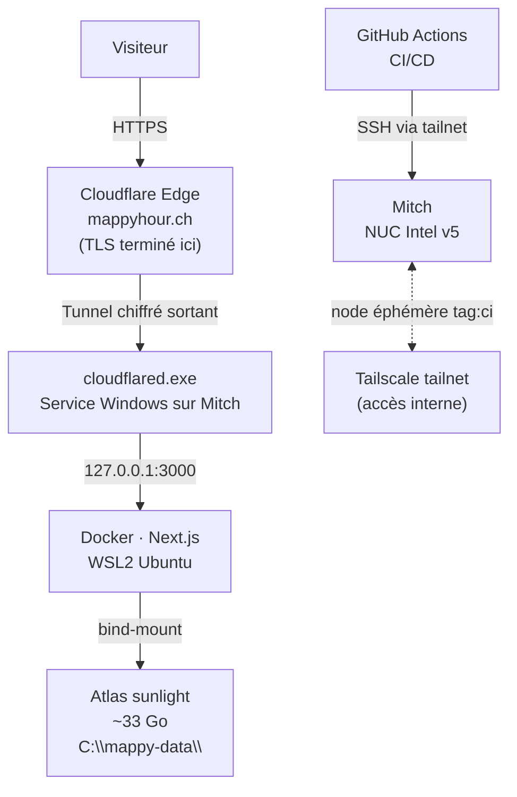

MappyHour charge 33 Go d'atlas géospatiaux au démarrage, fait tourner des workers GPU en Vulkan, et sert des streams SSE de plusieurs minutes. Vercel timeout à 10 secondes. Fly.io facture le CPU. La solution évidente — un NUC dans mon bureau — était aussi la bonne.

## La machine : Mitch

Un NUC, c'est un mini-PC Intel — un pavé en alu brossé d'une quinzaine de centimètres de côté, conçu pour tenir partout et consommer peu. Le mien est une version 5, logé dans un boîtier Cirrus7 : refroidissement passif, sans ventilateur, sans bruit. Zéro décibel. Les Allemands de Cirrus7 avaient glissé des Haribo dans la boîte à l'expédition. *Sie sind so süß.*

Seize ans d'âge. Il tourne sous Windows 10 — oui, celui dont le support s'arrête bientôt. C'est sur la liste. En attendant, il embarque le tout premier SSD grand public en SATA III : 118 Go, révolutionnaire à l'époque, et qui en 2026 te laisse 20 Go de libre après avoir installé Windows.

Mais pour servir une app Next.js et 33 Go de données précalculées, ça tient.

## De l'URL moche au vrai domaine

Première étape : Tailscale Funnel. Tailscale est un réseau privé virtuel qui connecte tes machines entre elles comme si elles étaient sur le même réseau local, peu importe où elles sont dans le monde. La fonctionnalité Funnel va plus loin : elle expose un port local vers Internet, avec TLS géré automatiquement. En dix minutes, MappyHour est accessible depuis n'importe où — à l'URL `mitch.tail63c42d.ts.net`.

Fonctionnel. Pas imprimable sur une carte de visite.

Il me fallait `mappyhour.ch`. J'ai créé un compte Infomaniak depuis mon téléphone, acheté le domaine, connecté un compte Cloudflare avec mon GitHub. J'ai généré des clés API à durée de vie d'un jour — Infomaniak d'un côté, Cloudflare de l'autre — et je les ai toutes passées à Claude avec une instruction : rends ce site accessible sur ce domaine, débrouille-toi.

La délégation a été totale. Claude a cartographié l'architecture, identifié les contraintes, et tout exécuté via API. La première idée — pointer `mappyhour.ch` vers l'URL Tailscale via un CNAME — ne pouvait pas fonctionner : le navigateur aurait vu un certificat TLS émis pour `*.tail63c42d.ts.net`, pas pour `mappyhour.ch`. Erreur de cert. C'est une limite structurelle de Tailscale Funnel qui n'existe pas pour les hébergeurs classiques — parce que c'est eux qui gèrent le TLS. Quand on héberge soi-même, c'est notre problème.

La solution : **Cloudflare Tunnel**. `cloudflared` ouvre une connexion sortante de Mitch vers l'edge Cloudflare — sans IP publique, sans port-forwarding. Cloudflare gère le TLS pour `mappyhour.ch`. Gratuit.

Avec les clés du jour, Claude a tout enchaîné : transfert des nameservers chez Cloudflare via l'API Infomaniak, création du tunnel, configuration des règles d'ingress, création des CNAME DNS — puis installation de `cloudflared` sur Mitch en SSH comme service Windows à démarrage automatique. Moi, j'ai regardé les confirmations défiler.

Propagation DNS : vingt minutes. [mappyhour.ch](https://mappyhour.ch) opérationnel.

## L'architecture en place

Le chemin public passe par Cloudflare. Le chemin CI/CD passe par Tailscale — le runner GitHub Actions rejoint le tailnet via un client OAuth éphémère, déploie sur Mitch en SSH, et disparaît à la fin du job.

## Umami : analytics sans cookies

Umami s'ajoute dans le `docker-compose.yml`. Le tracker est proxifié par Next.js sur `/_analytics/*` — pas de domaine tiers visible, pas de cookies, pas de bannière RGPD nécessaire. Setup via API depuis un tunnel SSH local, UUID baked dans le bundle au build.

## La sécurité : ce qu'on rate seul — et pourquoi Windows 10 aide à se concentrer

Mitch tourne sous Windows 10, dont le support de sécurité s'arrête bientôt. Ce n'est pas une raison de paniquer, mais c'est une raison de ne jamais laisser la machine exposée directement sur Internet. Cloudflare Tunnel n'est donc pas seulement une solution pour le domaine personnalisé — c'est aussi un choix délibéré : Mitch n'ouvre aucun port entrant, ne répond à aucune connexion directe depuis l'extérieur. Tout le trafic passe par Cloudflare, qui absorbe les scans, les tentatives de connexion et le bruit de fond d'Internet.

Ça ne remplace pas un OS à jour, mais ça réduit drastiquement la surface d'exposition.

Au-delà de ça, j'aurais probablement raté une demi-douzaine de choses en faisant ça à l'instinct. Rate limiting sur les endpoints de calcul. Fermeture des routes admin depuis l'extérieur. Isolation réseau entre containers. Des évidences une fois nommées, des angles morts sans quelqu'un pour les soulever.

À ceux qui affirment que développer avec un LLM pose des problèmes de sécurité : peut-être. Moins sûrement qu'un déploiement fait à l'arrache sans se poser les bonnes questions.

## La suite — et la facture qui va grimper

J'ai pris goût au self-hosting. Le problème, c'est que si je veux étendre MappyHour à d'autres villes — Berne, Zurich, Genève — les tuiles précalculées vont grossir bien au-delà des 33 Go actuels. Le SSD de Mitch ne suivra pas. Il va falloir investir dans un disque de 500 Go ou plus, ce qui va faire monter la facture d'exploitation au-dessus de 85 centimes par mois pour la première fois.

Le domaine reste la ligne la plus chère du tableau.

| Item | Coût mensuel |
|---|---|
| NUC Mitch (déjà possédé) | 0 CHF |
| Cloudflare Tunnel | 0 CHF |
| Tailscale (plan personal) | 0 CHF |
| Umami (self-hosted) | 0 CHF |
| Domaine mappyhour.ch | ~0.85 CHF (~10 CHF/an, Infomaniak) |
| **Total actuel** | **~0.85 CHF** |

Pour l'instant.

---

*D'ailleurs, si tu as un SSD SATA III ou un vieux M.2 qui traîne, [mappyhour@seesharp.ch](mailto:mappyhour@seesharp.ch) — j'accepte les donations.*
