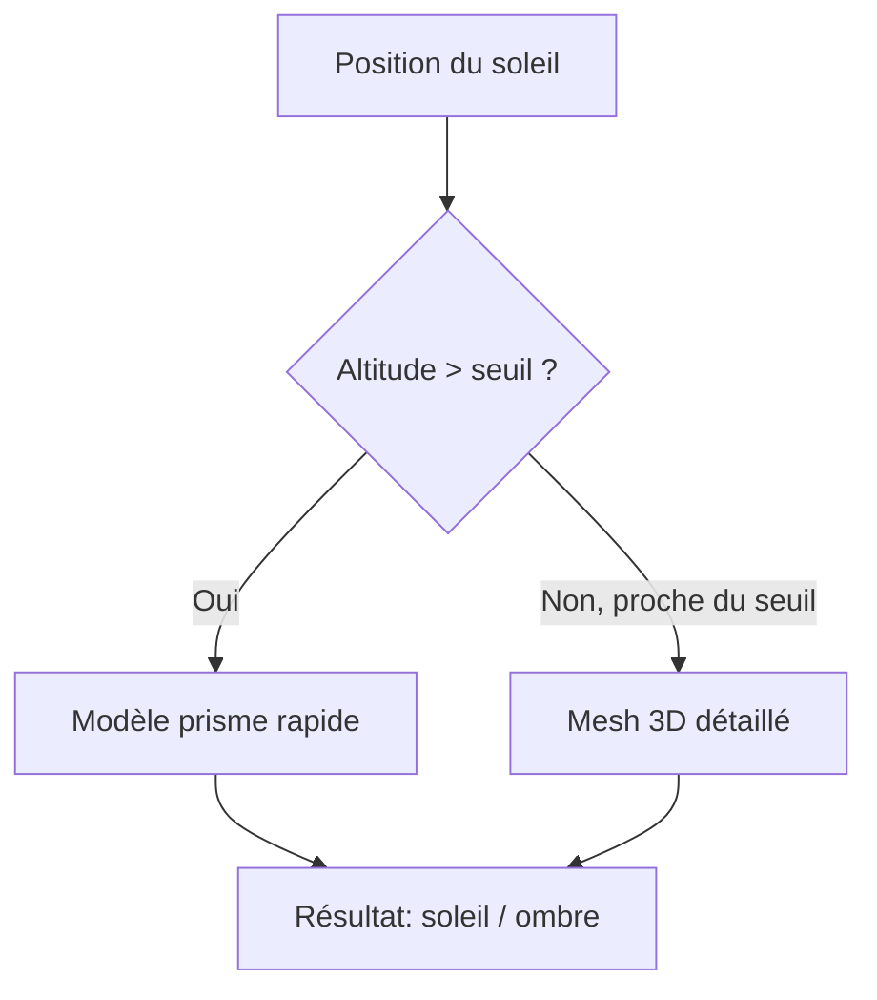

Dimanche matin, début mars. 8h. Tout le monde dort encore. Dehors il fait 4 degrés et la saison des barbecues se fait méchamment attendre. Le genre de matin où tu fixes ton café en te demandant quand est-ce que tu pourras enfin t'asseoir en terrasse sans te les geler.

Et là, au lieu de me rendormir comme une personne normale, j'ai ouvert un terminal et tapé `npx create-next-app`. Parce que j'avais une question existentielle : est-ce que cette terrasse sur la place de la Riponne est vraiment au soleil à 16h, ou est-ce que l'immeuble d'en face me gâche l'apéro ?

## Le problème

Lausanne, c'est beau, mais c'est en pente. Et qui dit pente dit ombre. Le soleil tape à 14h sur une terrasse, et à 15h c'est fini parce qu'un immeuble de six étages décide que l'apéro est terminé. Google Maps ne te dit pas ça. Météo Suisse non plus.

J'en avais marre de m'installer en terrasse pour me retrouver à l'ombre 20 minutes plus tard. Alors j'ai fait ce que tout développeur ferait : j'ai sur-ingéniéré une solution.

## Le stack

Next.js, Leaflet, et beaucoup de maths. L'idée de base est simple : pour un point donné et une heure donnée, est-ce que le soleil est visible ?

En pratique, c'est trois couches de calcul :

1. **Le terrain** -- les montagnes et collines entre la Suisse et la France, via SwissALTI3D (résolution 2m) et le DEM Copernicus pour l'horizon transfrontalier
2. **Les bâtiments** -- les données SwissBUILDINGS3D de Swisstopo, des vrais modèles 3D, pas des boîtes extrudées (enfin, un peu des deux)
3. **La végétation** -- la canopée des arbres via swissSURFACE3D

Pour chaque point, on trace un rayon vers le soleil et on regarde si quelque chose le bloque. Simple sur le papier. Moins simple quand tu as des milliers de bâtiments à tester.

## Le compromis qui a tout changé

La première version utilisait les mesh 3D complets de Swisstopo pour les ombres de bâtiments. Précis, mais lent. La deuxième utilisait des prismes simplifiés -- rapide, mais avec des faux positifs. La troisième fait les deux.

Le modèle prisme tourne en premier. Si le soleil est clairement au-dessus ou en-dessous de l'horizon des bâtiments, pas besoin de sortir l'artillerie lourde. Le mesh détaillé n'intervient que dans la zone de transition -- les 2 degrés autour du seuil d'ombre. Résultat : la précision du mesh avec les performances du prisme.

## Le pipeline de données

Le plus sous-estimé du projet. Avant de calculer quoi que ce soit, il faut :

- Télécharger les GeoTIFF de terrain via l'API STAC de Swisstopo
- Parser des fichiers DXF de bâtiments 3D (oui, DXF, comme en 1982)
- Construire un index spatial pour que le ray-tracing ne teste pas les 50'000 bâtiments de Lausanne à chaque requête
- Précalculer un masque d'horizon à 360 degrés pour chaque zone

Tout ça tient dans des scripts d'ingestion qu'on lance une fois. Après, c'est du cache en tuiles de 250m avec invalidation automatique quand le modèle évolue.

## Et concrètement ?

Tu ouvres la carte. Tu cliques sur une terrasse. L'app te dit : soleil de 11h à 15h20, après c'est l'immeuble au nord qui prend le relais. Tu peux aussi voir la grille colorée en temps réel -- jaune pour le soleil, rouge pour l'ombre -- et regarder l'animation de la journée défiler.

Ça marche pour Lausanne et Nyon. Parce que c'est là que je bois des coups.

## Ce que j'ai appris

Que la donnée publique suisse est exceptionnelle. SwissALTI3D, SwissBUILDINGS3D, swissSURFACE3D -- tout est accessible, documenté, et d'une précision ridicule. Le vrai travail, c'est de transformer ces données brutes en quelque chose d'utilisable à la vitesse d'une requête HTTP.

Et que le meilleur moteur de motivation pour un side project, c'est un apéro au soleil.
