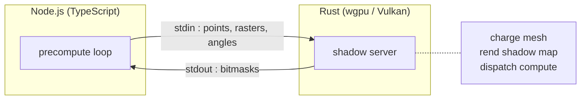

J'écris du C#, du TypeScript et même du Python pour mettre de la brioche sur la table depuis 2007. Dix-neuf ans. Je sais ce que je fais. Je lis le code, je comprends pourquoi il marche, je peux le debugger les yeux fermés à 2h du matin.

Et puis j'ai dû écrire du Rust et des shaders GPU.

## Pourquoi pas juste WebGPU

L'[article précédent](/blog/preview/b4e1f723/pourquoi-compute-shaders) explique pourquoi il faut des compute shaders. Reste la question : comment y accéder depuis un serveur Node.js ?

La réponse évidente : **WebGPU via Dawn**. Dawn, c'est l'implémentation C++ de WebGPU par Google — la même qui tourne dans Chrome. Il existe des bindings Node.js. Sur le papier, c'est le choix naturel.

Sur le papier.

En pratique, Dawn sur Windows utilise **Direct3D 12** comme backend GPU natif. Et le driver D3D12 d'Intel Arc (mon GPU de développement) a un problème : quand un contexte D3D12 coexiste avec des opérations de fichiers lourdes dans le même processus Node.js, **le driver crash**. Pas une erreur propre. Un crash silencieux du process. Vérifié, reproduit, documenté. Pas de contournement connu.

Le bug n'est pas dans WebGPU — c'est dans la couche native en dessous. Mais puisque Dawn utilise D3D12 par défaut sur Windows, WebGPU hérite du problème.

J'avais besoin d'un backend GPU qui :
1. Tourne sur Intel Arc sans crash
2. Supporte les compute shaders
3. Puisse tourner côté serveur (pas de navigateur)

**Vulkan** coche les trois cases. Le driver Vulkan d'Intel Arc est stable, testé, et les compute shaders fonctionnent. Mais Vulkan, c'est du C — des centaines de structs à remplir pour créer un buffer. Pas exactement mon quotidien de dev web.

## wgpu : l'API WebGPU, le backend Vulkan

La bibliothèque **wgpu**, écrite en Rust, résout l'équation. Elle expose une API quasi-identique à WebGPU (même modèle mental : device, queue, bind groups, pipelines) mais utilise **Vulkan** comme backend natif au lieu de D3D12. Le shader est écrit en WGSL, exactement comme pour WebGPU — seule la tuyauterie de transport change.

En Rust.

Je ne connais pas Rust.

## L'architecture : un sous-processus qui parle JSON

Plutôt que d'intégrer wgpu dans Node.js via des bindings natifs (fragile, compile croisée, cauchemar de maintenance), j'ai fait un choix pragmatique : un **exécutable Rust autonome** qui communique avec Node via **stdin/stdout en JSON**.

Node envoie un message JSON : "voici 62'500 points, voici les rasters de végétation, évalue ces 60 frames." Le serveur Rust charge le mesh des bâtiments une fois, rend un shadow map par frame, dispatch le compute shader, et renvoie les bitmasks. Node les copie directement dans l'artefact final — 5 `memcpy`, pas de boucle JavaScript.

Le serveur Rust est **long-lived** : il démarre une fois par région, garde le mesh en mémoire, et traite les tuiles une par une. Les uploads (horizon, végétation) sont dédupliqués par hash — si deux tuiles consécutives partagent les mêmes rasters, le serveur ne re-upload pas.

## Le vibe coding, pour de vrai

Voici ce que je ne connaissais pas avant ce projet :

- **Rust** — ownership, lifetimes, `async`, `Result<T, E>`, `bytemuck`, le système de build cargo
- **wgpu** — device, adapter, queue, bind group layout, pipeline, command encoder, staging buffers
- **WGSL** — `@compute`, `@workgroup_size`, `storage` buffers, `atomicAdd`, `textureLoad`
- **Vulkan** (concepts) — validation layers, device limits, `mapAsync`, `poll(Wait)`

Tout. Je ne connaissais littéralement rien de tout ça.

J'ai travaillé avec Claude — le même outil qui écrit ces articles. Je décrivais ce que je voulais ("porte le terrain check sur GPU"), il proposait le code Rust + WGSL, je testais, on itérait. Quand ça plantait, je lui collais l'erreur et on corrigeait ensemble. Quand ça marchait, je benchmarkais et on passait à la suite.

C'est la définition du vibe coding : tu pilotes la direction, l'IA écrit le code, tu valides par les résultats. Tu ne comprends pas **pourquoi** `@workgroup_size(256)` est le bon choix. Tu ne sais pas **pourquoi** le bind group layout a besoin d'un `minBindingSize`. Tu fais confiance au processus.

Et ça marche. Le serveur Rust tourne, les shaders computent, les bitmasks arrivent, les benchmarks confirment le 4x de speedup. Objectivement, c'est un succès.

## Le malaise

Sauf que je ne comprends pas mon propre code.

Je peux lire le WGSL ligne par ligne et dire ce que chaque instruction fait. Mais je ne pourrais pas l'écrire de zéro. Je ne pourrais pas debugger un crash Vulkan validation layer sans aide. Je ne saurais pas dimensionner un workgroup pour un GPU différent.

En 19 ans de dev, je n'ai jamais eu cette sensation. Même quand j'apprenais un nouveau framework, je comprenais les abstractions sous-jacentes. Ici, les abstractions sont **opaques**. Je sais que `device.create_bind_group_layout` fait quelque chose d'important. Je ne sais pas exactement quoi.

C'est le syndrome de l'imposteur dans sa forme la plus pure : le code fonctionne, les benchmarks sont bons, le résultat est en production — et je ne suis pas sûr d'avoir le droit de sabrer le champagne. Encore moins de l'ajouter sur le CV.

## Ce que j'en retiens

Le vibe coding est un outil légitime pour l'**exploration**. Sans lui, je n'aurais jamais touché à Vulkan — le coût d'apprentissage aurait été prohibitif pour un side project. Le ratio effort/résultat est imbattable.

Mais l'exploration sans compréhension, c'est une dette. À un moment, il faut rembourser. C'est pour ça que j'écris ces articles — pas pour expliquer Vulkan aux autres, mais pour me forcer à comprendre ce que j'ai construit.

Si le compute shader qui tourne en production te semble magique, c'est que tu n'as pas encore pris le temps de le démystifier. Et si tu ne le fais pas, la prochaine fois que ça casse, tu seras exactement aussi démuni que la première fois.

Le vibe coding t'emmène loin. Comprendre ce que tu as fait t'empêche d'y retourner les mains vides.
