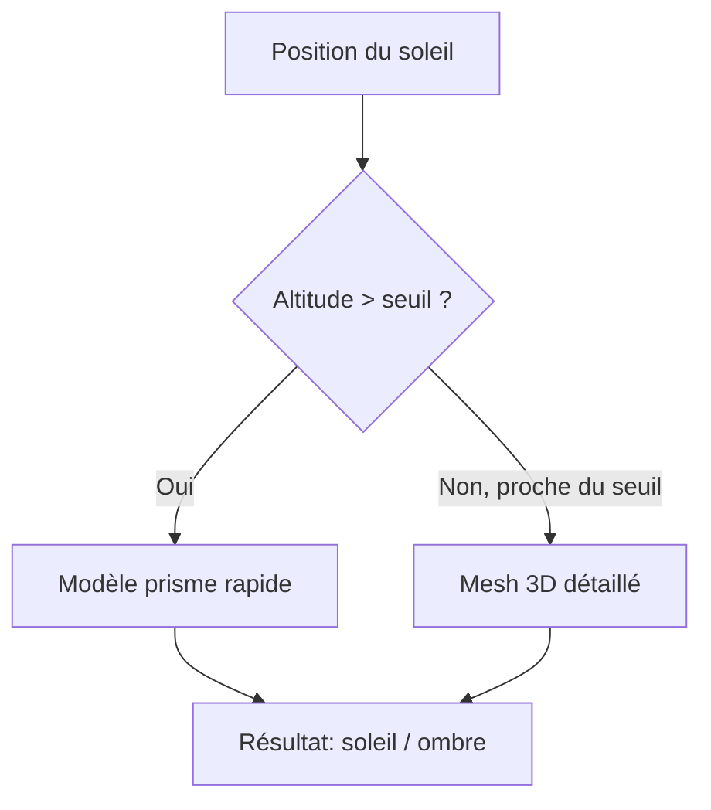

Dimanche matin, début mars. 8h. Tout le monde dort encore. Dehors il fait 4 degrés et la saison des barbecues se fait méchamment attendre. Le genre de matin où tu fixes ton café en te demandant quand est-ce que tu pourras enfin t'asseoir en terrasse sans te les geler.

Et là, au lieu de me rendormir comme une personne normale, j'ai ouvert un terminal et tapé `npx create-next-app`. Parce que j'avais une question existentielle : est-ce que cette terrasse sur la place de la Riponne est vraiment au soleil à 16h, ou est-ce que l'immeuble d'en face me gâche l'apéro ?

## Le problème

Lausanne, c'est beau, mais c'est en pente. Et qui dit pente dit ombre. Le soleil tape à 14h sur une terrasse, et à 15h c'est fini parce qu'un immeuble de six étages décide que l'apéro est terminé. Google Maps ne te dit pas ça. Météo Suisse non plus.

J'en avais marre de m'installer en terrasse pour me retrouver à l'ombre 20 minutes plus tard. Alors j'ai fait ce que tout développeur ferait : j'ai sur-ingéniéré une solution.

## Le stack

Next.js, Leaflet, et beaucoup de maths. L'idée de base est simple : pour un point donné et une heure donnée, est-ce que le soleil est visible ?

En pratique, c'est trois couches de calcul :

1. **Le terrain** -- les montagnes et collines entre la Suisse et la France, via SwissALTI3D (résolution 2m) et le DEM Copernicus pour l'horizon transfrontalier
2. **Les bâtiments** -- les données SwissBUILDINGS3D de Swisstopo, des vrais modèles 3D, pas des boîtes extrudées (enfin, un peu des deux)
3. **La végétation** -- la canopée des arbres via swissSURFACE3D

Pour chaque point, on trace un rayon vers le soleil et on regarde si quelque chose le bloque. Simple sur le papier. Moins simple quand tu as des milliers de bâtiments à tester.

## Le compromis qui a tout changé

La première version utilisait les mesh 3D complets de Swisstopo pour les ombres de bâtiments. Précis, mais lent. La deuxième utilisait des prismes simplifiés -- rapide, mais avec des faux positifs. La troisième fait les deux.

Le modèle prisme tourne en premier. Si le soleil est clairement au-dessus ou en-dessous de l'horizon des bâtiments, pas besoin de sortir l'artillerie lourde. Le mesh détaillé n'intervient que dans la zone de transition -- les 2 degrés autour du seuil d'ombre. Résultat : la précision du mesh avec les performances du prisme.

## Le pipeline de données

Le plus sous-estimé du projet. Avant de calculer quoi que ce soit, il faut :

- Télécharger les GeoTIFF de terrain via l'API STAC de Swisstopo
- Parser des fichiers DXF de bâtiments 3D (oui, DXF, comme en 1982)
- Construire un index spatial pour que le ray-tracing ne teste pas les 50'000 bâtiments de Lausanne à chaque requête
- Précalculer un masque d'horizon à 360 degrés pour chaque zone

Tout ça tient dans des scripts d'ingestion qu'on lance une fois. Après, c'est du cache en tuiles de 250m avec invalidation automatique quand le modèle évolue.

## Et concrètement ?

Tu ouvres la carte. Tu cliques sur une terrasse. L'app te dit : soleil de 11h à 15h20, après c'est l'immeuble au nord qui prend le relais. Tu peux aussi voir la grille colorée en temps réel -- jaune pour le soleil, rouge pour l'ombre -- et regarder l'animation de la journée défiler.

Ça marche pour Lausanne et Nyon. Parce que c'est là que je bois des coups.

## Ce que j'ai appris

Que la donnée publique suisse est exceptionnelle. SwissALTI3D, SwissBUILDINGS3D, swissSURFACE3D -- tout est accessible, documenté, et d'une précision ridicule. Le vrai travail, c'est de transformer ces données brutes en quelque chose d'utilisable à la vitesse d'une requête HTTP.

Et que le meilleur moteur de motivation pour un side project, c'est un apéro au soleil.

<!--
==========================================================================
NOTES POUR CONTINUER L'ARTICLE (ne pas publier cette section)
==========================================================================

## Corrections à faire

- Le diagramme Mermaid "compromis" est trompeur : le mode par défaut est maintenant
  "detailed" (mesh complet, 32 passes de raffinement). Le two-level existe toujours
  en config (MAPPY_BUILDINGS_SHADOW_MODE) mais le prisme seul n'est plus le défaut.
  Réécrire la section pour refléter l'évolution : prisme → two-level → detailed.

## Sections à ajouter dans cet article (ton léger)

### "Trouver un bar au soleil"
- L'app interroge OpenStreetMap (Overpass API) pour les terrasses, bars, restos, parcs
- Endpoint /api/places avec filtres (category=terrace_candidate, outdoorOnly=true)
- Calcule les fenêtres de soleil par venue (/api/places/windows)
- Le vrai use case apéro : "tu cherches pas un bar, tu cherches un bar au soleil à 17h"

### Conclusion : "4h et un LLM"
- Premier prototype fonctionnel en 4h (premier commit : dimanche 8 mars 2026, 07:57)
- Impossible sans LLM, pas parce que le code est compliqué, mais parce que les MATHS
  sont le bottleneck : trouver les bons outils mathématiques (ray-tracing, projection
  LV95↔WGS84, correction de réfraction atmosphérique, dot products pour le corridor...)
  → "je vois comment ça marche en bougeant les mains, mais trouver la formule, jamais"
- LLM utilisé : GPT Codex 5.3 en mode extra-high
- Méthodologie trial-and-error pour les optimisations : essayer, mesurer, garder ou jeter

## Article 2 prévu (deep-dive technique)

Titre possible : "Comment j'ai ray-tracé toute une ville en temps réel"

### Images à générer (ChatGPT) pour illustrer les concepts :

1. **Le corridor** — vue de dessus : un rayon solaire avec un rectangle (AABB) autour,
   padding = maxHalfDiagonal + 64m. Seules les cellules de grille qui intersectent
   le corridor sont testées. Montrer les cellules ignorées en grisé.

2. **La grille 64m** — vue de dessus d'un quartier divisé en cellules de 64m×64m.
   Chaque cellule contient des indices vers les bâtiments qui la touchent.
   Sans grille : 962 obstacles testés. Avec grille : ~1. Speedup 4.25x.

3. **Le centre de tuile 250m** — une tuile de 250m×250m avec son point central.
   Le contexte d'évaluation (bâtiments candidats, horizon, terrain) est calculé
   une seule fois pour ce point, puis partagé pour tous les points de la tuile.
   Speedup 45.8x.

4. **Le masque d'horizon** — visualisation polaire : 360 bins (1 par degré d'azimut),
   chaque bin = angle d'élévation max dans cette direction.
   Raycast jusqu'à 120km avec correction de réfraction atmosphérique.
   Le Jura français qui projette des ombres sur Lausanne en fin de journée.

5. **Un bâtiment après ingestion** — DXF parsé → footprint 2D simplifié (polygon)
   + hauteur + bounding box. Montrer le mesh 3D brut vs le prisme simplifié vs
   les données stockées (footprint[], height, centerX/Y, halfDiagonal).

6. **Le modèle de végétation (raster)** — GeoTIFF à 0.5m de résolution.
   "Raster" = grille régulière où chaque pixel = élévation de surface (sol + arbres).
   Échantillonné par interpolation bilinéaire tous les 2m le long du rayon solaire.
   Montrer une heatmap d'élévation avec les arbres qui ressortent.

### Contenu technique du deep-dive :

- Benchmarks détaillés :
  - Lot A (grille 64m + corridor) : 4.25x
  - Lot B (contexte partagé par tuile 250m) : 45.8x
  - Lot C (horizon mask adaptatif, macro-cells 2000m×500m) : ~20 tuiles partagent, 4 locales
  - Cumulé : 54.6x (155.8 pts/sec vs 2.85 pts/sec)

- Méthodologie trial-and-error :
  - Documenter ce qui a marché et ce qui n'a pas marché
  - Le prisme seul avait trop de faux positifs → ajout du mesh détaillé
  - Le mesh seul était trop lent → ajout du corridor + grille spatiale
  - L'horizon par point était redondant → partage adaptatif par macro-cell

- Architecture 3 modes (prism / two-level / detailed) :
  - prism : footprint extrudé, le plus rapide, faux positifs
  - two-level : prism + vérification mesh dans les 2° autour du seuil, max 3 raffinements
  - detailed : mesh complet, 32 passes de raffinement, le plus précis (défaut actuel)
  - Config via MAPPY_BUILDINGS_SHADOW_MODE

- Le pipeline de données complet :
  - STAC API → DXF ZIP → parse DXF → footprint extraction → simplification → spatial grid
  - Copernicus DEM 30m pour l'horizon transfrontalier (France)
  - swissSURFACE3D raster 0.5m pour la canopée
  - Deduplication des bâtiments (même footprint+hauteur = même bâtiment)
-->
