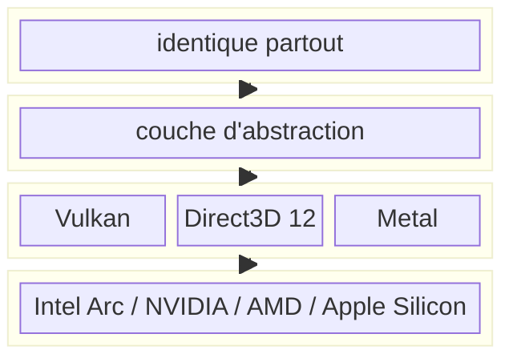

Dans [l'article sur la rasterisation GPU](/blog/preview/f7a2c891/rasterisation-gpu), j'ai implémenté un shadow map via headless-gl qui donne un speedup de 91x sur les bâtiments. Le ray-tracing CPU à 2000 µs par évaluation est tombé à 22 µs. Victoire.

Sauf que le bottleneck s'est déplacé.

## 3.75 millions d'opérations en JavaScript

Le shadow map résout **un** problème : "ce point est-il dans l'ombre d'un bâtiment ?" Un rendu GPU, puis un lookup O(1) dans le depth buffer pour chaque point. Rapide.

Mais pour chaque point de ma grille, il reste trois autres questions auxquelles le shadow map ne répond pas :

1. **Le terrain bloque-t-il le soleil ?** Lookup dans un masque d'horizon pré-calculé (360 angles par masque, interpolation par azimuth solaire).
2. **Un arbre bloque-t-il le soleil ?** Ray-march sur les rasters SwissSurface3D : 60 pas de 2 mètres le long du rayon solaire, avec test de clearance à 4 mètres.
3. **Le point est-il "ensoleillé" ?** Combinaison des trois résultats : `sunny = PAS(terrain) ET PAS(bâtiment) ET PAS(végétation)`.

Pour une tuile de 250 mètres au pas de 1 mètre, ça fait 62'500 points. Sur une journée (06h-21h) échantillonnée toutes les 15 minutes, ça fait 60 frames. Soit **3.75 millions d'itérations** — en JavaScript, séquentiellement, point par point.

Le shadow map m'a donné la réponse bâtiment en 0.4 seconde. Mais la boucle JS qui traite le terrain, la végétation et les masques sunny prend **12 secondes**. Le GPU fait 3% du travail.

## Le rendering ne suffit pas

Le problème fondamental de headless-gl, c'est que c'est un contexte **WebGL 1.0** — autrement dit OpenGL ES 2.0. Il sait faire une chose : du rendu. Tu lui donnes des triangles, il te rend une image (ou un depth buffer). Point.

Ce que je voudrais faire, c'est dire au GPU : "voici 62'500 points avec leurs coordonnées et leurs élévations, voici 3 masques d'horizon, voici les rasters de végétation — maintenant, pour **chaque point en parallèle**, fais le terrain check, le ray-march végétation, et la combinaison finale."

Pas de triangles. Pas d'image. Juste du calcul brut sur des tableaux de données. C'est exactement ce que font les **compute shaders** — du code arbitraire qui tourne sur le GPU, sans lien avec le pipeline de rendu.

Et headless-gl n'en a pas. WebGL 1.0 est une spec de 2011. Les compute shaders sont arrivés bien après — avec OpenGL 4.3, puis Vulkan, puis WebGPU.

## C'est quoi un compute shader

Un GPU, c'est des milliers de petits processeurs identiques qui font tous la même chose en même temps. Le pipeline de rendu traditionnel les utilise pour colorier des pixels. Un compute shader, c'est détourner ces processeurs pour faire **n'importe quoi d'autre**.

Tu écris une fonction. Tu lui donnes un numéro de thread — "tu es le point 4'837 sur 62'500". Tu la dispatches. Le GPU lance les 62'500 instances en parallèle. Chaque thread lit ses données dans un buffer partagé, fait son calcul, écrit son résultat. Pas de pixels, pas de triangles, pas d'écran.

Concrètement, ma boucle JavaScript de 12 secondes :

```typescript
for (let i = 0; i < 62500; i++) {
  terrainBlocked = checkHorizon(point[i], azimuth);
  vegetationBlocked = rayMarchVegetation(point[i], azimuth);
  sunny[i] = !terrainBlocked && !buildingBlocked[i] && !vegetationBlocked;
}
```

...devient un shader de quelques lignes, dispatché en une seule commande GPU :

```wgsl
@compute @workgroup_size(256)
fn main(@builtin(global_invocation_id) id: vec3u) {
    let idx = id.x;
    if (idx >= pointCount) { return; }
    // terrain, vegetation, sunny — même logique, mais 256 points à la fois
}
```

Le langage s'appelle **WGSL** (WebGPU Shading Language). C'est un langage minimaliste, typé, sans allocations dynamiques, sans récursion — conçu pour que le compilateur GPU puisse le paralléliser sans surprises. Ça ressemble vaguement à du Rust qui aurait fait un régime.

Le `@workgroup_size(256)` dit au GPU : "regroupe les threads par paquets de 256 et exécute-les ensemble." Mon Intel Arc A770M a 256 unités d'exécution — un workgroup remplit pile la machine. Le runtime en pipeline des centaines de workgroups derrière, tant qu'il y a des données à traiter.

Le travail par point est **identique** — terrain, végétation, sunny. La différence : au lieu d'attendre son tour dans une boucle `for`, chaque point est un thread GPU qui s'exécute en même temps que 255 autres.

<div id="viz-compute" style="width: 100%; margin: 2rem 0; border-radius: 6px; overflow: hidden; background: var(--bg2, #13151a); border: 1px solid var(--border, #1e2128);">
  <div style="padding: 0.75rem 1rem; display: flex; gap: 0.5rem; flex-wrap: wrap; align-items: center;">
    <button id="btn-js" onclick="startSequential()" style="background: var(--bg, #111316); color: var(--text-body, #c8c9cd); border: 1px solid var(--border, #1e2128); padding: 0.4rem 1rem; border-radius: 4px; font-family: var(--mono, monospace); font-size: 0.8rem; cursor: pointer;">JavaScript (séquentiel)</button>
    <button id="btn-gpu" onclick="startParallel()" style="background: var(--bg, #111316); color: var(--text-body, #c8c9cd); border: 1px solid var(--border, #1e2128); padding: 0.4rem 1rem; border-radius: 4px; font-family: var(--mono, monospace); font-size: 0.8rem; cursor: pointer;">GPU (256 threads/vague)</button>
    <span id="viz-status" style="font-family: var(--mono, monospace); font-size: 0.8rem; color: var(--text-body, #c8c9cd); margin-left: auto;"></span>
  </div>
  <canvas id="grid-canvas" style="display: block; width: 100%; image-rendering: pixelated;"></canvas>
</div>

<script>
(function() {
  var canvas = document.getElementById('grid-canvas');
  var ctx = canvas.getContext('2d');
  var status = document.getElementById('viz-status');
  var COLS = 50, ROWS = 50, TOTAL = COLS * ROWS;
  var CELL = 6, GAP = 1, SIZE = CELL + GAP;
  var animId = null;

  canvas.width = COLS * SIZE + GAP;
  canvas.height = ROWS * SIZE + GAP;
  canvas.style.maxHeight = (ROWS * SIZE + GAP) + 'px';

  // Fake shadow data: ~40% in shadow (diagonal band)
  var shadow = new Uint8Array(TOTAL);
  for (var i = 0; i < TOTAL; i++) {
    var x = i % COLS, y = Math.floor(i / COLS);
    shadow[i] = (x + y > 30 && x + y < 55 && Math.random() > 0.3) ? 1 : 0;
  }

  var state = new Uint8Array(TOTAL); // 0=pending, 1=processing, 2=done

  function draw() {
    ctx.fillStyle = '#0b0c0e';
    ctx.fillRect(0, 0, canvas.width, canvas.height);
    for (var i = 0; i < TOTAL; i++) {
      var x = (i % COLS) * SIZE + GAP;
      var y = Math.floor(i / COLS) * SIZE + GAP;
      if (state[i] === 0) ctx.fillStyle = '#1e2128';
      else if (state[i] === 1) ctx.fillStyle = '#7effd4';
      else ctx.fillStyle = shadow[i] ? '#2a2a3a' : '#d4a017';
      ctx.fillRect(x, y, CELL, CELL);
    }
  }

  function reset() {
    if (animId) { clearTimeout(animId); animId = null; }
    state.fill(0);
    draw();
    status.textContent = '';
  }

  window.startSequential = function() {
    reset();
    var idx = 0;
    function step() {
      if (idx >= TOTAL) { status.textContent = 'terminé — ' + TOTAL + ' points en ~5s'; return; }
      if (idx > 0) state[idx - 1] = 2;
      state[idx] = 1;
      draw();
      status.textContent = 'point ' + (idx + 1) + ' / ' + TOTAL;
      idx++;
      animId = setTimeout(step, 2);
    }
    step();
  };

  window.startParallel = function() {
    reset();
    var WGSIZE = 256;
    var wave = 0;
    var totalWaves = Math.ceil(TOTAL / WGSIZE);
    function step() {
      var start = wave * WGSIZE;
      var end = Math.min(start + WGSIZE, TOTAL);
      // Mark previous wave as done
      if (wave > 0) {
        var ps = (wave - 1) * WGSIZE;
        for (var j = ps; j < Math.min(ps + WGSIZE, TOTAL); j++) state[j] = 2;
      }
      if (start >= TOTAL) {
        draw();
        status.textContent = 'terminé — ' + TOTAL + ' points en ' + totalWaves + ' vagues de ' + WGSIZE;
        return;
      }
      for (var i = start; i < end; i++) state[i] = 1;
      draw();
      status.textContent = 'vague ' + (wave + 1) + '/' + totalWaves + ' — ' + WGSIZE + ' points en parallèle';
      wave++;
      animId = setTimeout(step, 120);
    }
    step();
  };

  draw();
})();
</script>

## La tuyauterie pour parler au GPU

Pour envoyer un compute shader au GPU, il faut passer par une API. Ça se joue à deux niveaux :



**En bas : les API natives.** Ce sont les interfaces qui parlent directement au driver GPU — chaque plateforme a la sienne. Vulkan (cross-platform), Direct3D 12 (Windows), Metal (macOS/iOS). Elles sont concurrentes. Ton GPU en supporte une ou plusieurs selon l'OS.

**Au-dessus : WebGPU.** C'est un standard W3C qui **s'abstrait** des API natives. Tu écris du code WebGPU, et l'implémentation le traduit en Vulkan, D3D12 ou Metal selon la plateforme — comme un compilateur qui cible des architectures différentes. Dans Chrome, c'est la bibliothèque **Dawn** (C++) qui fait cette traduction. En Rust, c'est **wgpu**.

Le point crucial : **le shader est le même quel que soit le chemin**. Le code WGSL qui tourne sur le GPU est identique que la tuyauterie passe par Vulkan, D3D12 ou Metal. C'est toute la promesse de WebGPU : écrire une fois, exécuter partout.

Pour Mappy Hour, le choix de la tuyauterie a été dicté par un bug driver : le driver **Direct3D 12** d'Intel Arc crashe quand un contexte GPU coexiste avec des opérations fichier lourdes dans le même processus. Or, sur Windows, les implémentations WebGPU utilisent D3D12 par défaut. La solution : forcer le backend **Vulkan** à la place — même shader, même API au-dessus, juste une tuyauterie native différente en dessous. Le [prochain article](/blog/preview/c9d2a845/vulkan-rust-vibe-coding) raconte cette histoire — et accessoirement, comment j'ai écrit du Rust et des shaders GPU pour la première fois de ma vie sans avoir la moindre idée de ce que je faisais.

## Le résultat

En portant le terrain, la végétation, et les masques sunny sur GPU via compute shaders :

| | headless-gl (shadow map seul) | + compute shaders |
|---|---|---|
| GPU fait | Bâtiments seulement | Bâtiments + terrain + végétation + sunny |
| Boucle JS | 62'500 pts x 60 frames = 3.75M ops | Éliminée (5 `memcpy` par frame) |
| Temps/tuile | ~12 s | ~3 s |
| **Speedup** | — | **4x** |

Le shadow map avait donné 91x sur les bâtiments. Les compute shaders donnent un 4x supplémentaire sur **tout le reste**. L'un ne remplace pas l'autre — ils résolvent des problèmes différents. Le shadow map transforme 907'000 triangles en un depth buffer. Le compute shader transforme 62'500 points en bitmasks. Deux outils, deux jobs.

Le total cumulé depuis le ray-tracing CPU pur : **le temps par tuile est passé de 42 secondes à 3 secondes**. Facteur 14. Et la boucle `for` en JavaScript qui faisait 97% du travail... n'existe plus.
