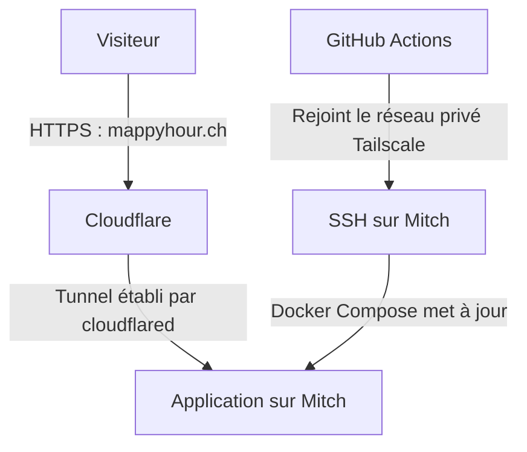

MappyHour tourne sur un petit NUC Intel équipé d'un Core i3-5010U, qui répond au nom de Mitch. J'avais déjà cette machine, avec Windows, une connexion internet et assez de ressources pour faire tourner l'application. Avant de louer un serveur ailleurs, j'ai voulu voir jusqu'où celui-là pouvait aller.

MappyHour aide à trouver des endroits au soleil. L'application est écrite en Next.js, mais elle ne sert pas seulement quelques pages : elle consulte aussi des données d'ensoleillement précalculées, environ **33 Go** à ce stade du projet. Il me faut donc une machine capable de faire tourner l'app et de garder ces fichiers à portée de main.

Le matériel était là. Restait à rendre l'app accessible depuis internet et à pouvoir la mettre à jour sans aller m'asseoir devant le serveur à chaque fois.

## Windows était déjà là

Mitch tourne sous Windows 10. Pour héberger une app dans un container Linux, ce n'est pas le choix le plus naturel. Mais Windows était déjà installé et, franchement, j'avais la flemme de tout refaire avant même de voir l'app tourner.

L'app tourne donc avec Docker dans Ubuntu, via WSL2, l'environnement Linux intégré à Windows.

La migration vers Linux aurait coûté du temps, et WSL2 suffit pour Docker. Certains combats ne méritent pas d'être gagnés.

Une fois l'app lancée sur Mitch, il a fallu la rendre accessible depuis l'extérieur.

## Publier l'app, pas ouvrir la machine

Garder Windows 10 pour démarrer, d'accord. En revanche, je n'ai pas envie d'ouvrir des ports depuis internet vers cette machine. Je veux rendre MappyHour accessible aux visiteurs, tout en gardant l'administration du NUC sur un réseau privé.

Tailscale me permet d'accéder au NUC à distance par ce réseau privé, notamment en SSH. Pour les visiteurs, j'ai commencé par sa fonction [Funnel](https://tailscale.com/docs/features/tailscale-funnel), qui publiait l'application à une adresse HTTPS en `.ts.net`. Les connexions passaient par un relais Tailscale, qui les transmettait au service choisi sur Mitch, sans redirection de ports sur le routeur.

Ça répondait au besoin : rendre le site public sans ouvrir aussi les accès d'administration. Pas question pour autant de considérer Windows comme protégé de tout. Les requêtes arrivent toujours jusqu'à l'app, avec les risques liés à ses éventuelles failles. Un tunnel ne remplace ni ses mises à jour ni celles du système.

Mais je voulais donner aux visiteurs une adresse un peu plus facile à retenir : `mappyhour.ch`.

La première piste a été de faire pointer ce domaine vers l'adresse Tailscale avec un alias DNS, un CNAME. Sauf qu'un alias DNS ne change pas le nom demandé par le navigateur. Celui-ci veut toujours joindre `mappyhour.ch`, alors que Funnel ne prend en charge que les noms du domaine Tailscale. Le CNAME ne lui ajoute ni la prise en charge de mon domaine ni le certificat correspondant.

J'avais donc une app accessible, mais pas encore à l'adresse que je voulais.

## Un tunnel pour les visiteurs

[Cloudflare Tunnel](https://developers.cloudflare.com/tunnel/) m'a permis de garder ce fonctionnement avec mon propre domaine. Sur Mitch, son connecteur `cloudflared` est installé comme **service Windows**, avec un démarrage automatique. Il tourne directement sous Windows, pas dans WSL ni dans le container de l'app.

Ce service établit une connexion sortante vers Cloudflare. Les visiteurs arrivent chez Cloudflare, qui gère le HTTPS de `mappyhour.ch` et transmet les requêtes à l'application par le tunnel. Toujours pas de port à ouvrir sur le routeur.

La création du tunnel, son association au domaine et la configuration DNS se pilotent aussi par API. Claude a préparé cette configuration, puis installé le connecteur en service Windows via SSH. Je n'ai pas eu besoin d'aller ouvrir un navigateur sur le NUC pour faire ces opérations.

Cloudflare prend donc en charge les visiteurs de l'app. Tailscale reste mon accès privé pour administrer Mitch. C'est aussi par là que passent les déploiements.

## Faire venir GitHub jusqu'à Mitch

Pour mettre l'app à jour, je pousse mes changements sur `master`. GitHub Actions construit l'image Docker et la publie dans GHCR, le registre d'images de GitHub. Une fois cette étape réussie, il reste à demander au NUC de récupérer l'image et de redémarrer le service.

Mais rendre le site public ne donne pas au workflow le droit d'administrer le serveur. Il lui faut un accès SSH, et je ne veux toujours pas ouvrir ce port sur internet pour les déploiements.

Puisque je passe moi-même par Tailscale pour l'administrer, le workflow peut faire la même chose.

L'[action Tailscale pour GitHub](https://github.com/tailscale/github-action) inscrit le runner dans mon réseau privé pour la durée du déploiement. Un client OAuth, dont les identifiants sont conservés dans les secrets GitHub, lui permet d'obtenir son autorisation automatiquement. Le runner reçoit une identité `tag:ci`, avec les accès prévus pour le déploiement.

Il peut alors se connecter à Mitch en SSH et lancer Docker Compose pour récupérer la nouvelle image et remettre l'app en route. À la fin du job, l'action déconnecte cette machine temporaire du réseau.

Cela donne deux chemins distincts vers le même serveur :

Je n'ai pas besoin d'ouvrir SSH sur internet ni de suivre les adresses IP des runners GitHub. Les clés SSH et les autorisations restent à gérer, mais le chemin réseau est le même que celui que j'utilise depuis mon laptop.

Mitch peut donc rester dans son coin. Je pousse une modification, GitHub la construit, puis la déploie sur le NUC.

## Et la facture ?

Le domaine me coûte environ **15 CHF par an**, soit **1,25 CHF par mois**. Pour cet usage, Cloudflare Tunnel et le forfait personnel Tailscale ne m'ajoutent pas d'abonnement payant. Docker Engine et l'outil de statistiques Umami tournent sur la machine.

Reste l'électricité. Les essais des NUC de cette génération, avec le même processeur que Mitch, donnent [environ 7 W au repos chez 01net](https://www.01net.com/tests/test-intel-nuc-nuc5i3ryh-le-tres-grand-avenir-des-tres-petits-pc-4696.html) et [9 W chez bit-tech](https://bit-tech.net/reviews/tech/intel-nuc-kit-nuc5i3ryk-review/6/).

Avec le [tarif SiL 2026 nativa SIMPLE à Lausanne](https://www.lausanne.ch/dam/jcr:407bb55b-498b-41b1-a0d2-c22c3acd2695/tarifs-electricite-particuliers-et-professionnels-2026.pdf), soit environ **32 centimes par kWh**, taxes et TVA comprises, cela représente **1,60 à 2,10 CHF pour trente jours allumé au repos**. L'app le fait aussi travailler : je retiens donc un ordre de grandeur de quelques francs par mois pour un usage léger, pas une facture mesurée sur Mitch.

Je paie déjà les frais fixes du raccordement et la connexion internet ; brancher le NUC ne crée pas un abonnement supplémentaire. Le matériel, je l'avais déjà acheté aussi. Le réutiliser évite une nouvelle dépense, mais ne le rend pas gratuit pour autant, et son éventuel remplacement reste à ma charge.

Pour les quelques dizaines d'utilisateurs de MappyHour, je n'ai pas besoin de louer une autre machine. J'accepte aussi les limites de celle-ci : si Mitch, son disque ou sa connexion s'arrêtent, le site s'arrête avec eux. Pas de deuxième serveur pour prendre le relais.

Ce qui me plaît dans ce montage, c'est de garder un déploiement automatisé avec une machine que j'avais déjà. Les visiteurs utilisent `mappyhour.ch` sans avoir besoin de savoir ce qui tourne derrière.

Mon hébergeur a un prénom. Et s'il tombe en panne, je sais assez précisément qui va devoir s'en occuper.
