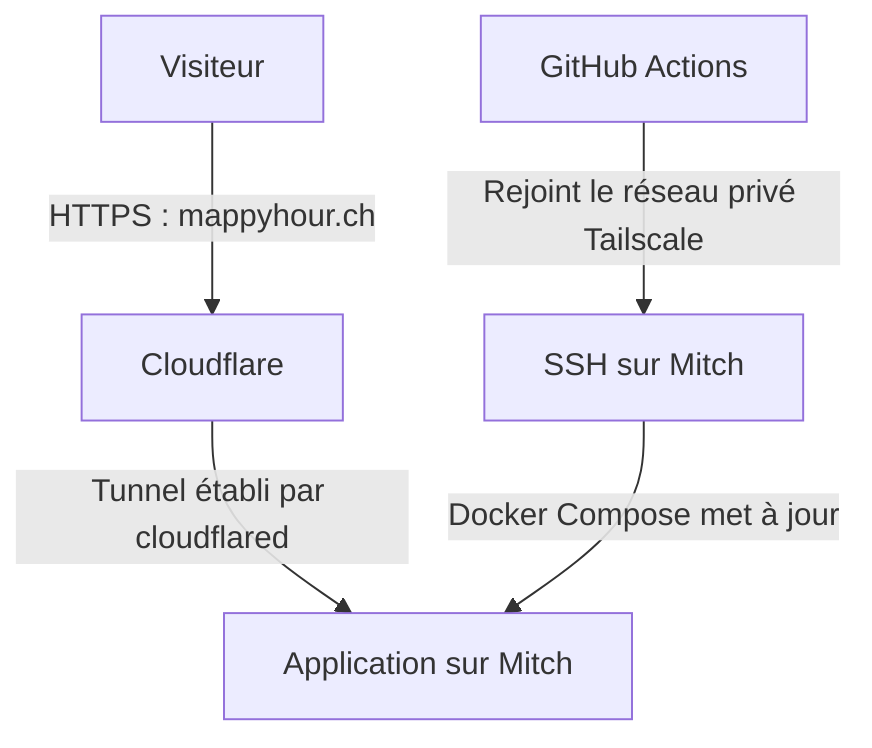

Pour héberger MappyHour, j'avais déjà une machine : un petit NUC Intel équipé d'un Core i3-5010U, qui répond au nom de Mitch. Il avait Windows, une connexion internet et assez de ressources pour faire tourner l'application. Avant de louer un serveur ailleurs, j'avais envie de voir jusqu'où celui-là pouvait aller.

MappyHour aide à trouver des endroits au soleil. L'application est écrite en Next.js, mais elle ne sert pas seulement quelques pages : elle consulte aussi des données d'ensoleillement précalculées, environ **33 Go** à ce stade du projet. Il me fallait donc une machine capable de faire tourner l'app et de garder ces fichiers à portée de main.

Le matériel était là. Restait à rendre l'app accessible depuis internet et à pouvoir la mettre à jour sans aller m'asseoir devant le serveur à chaque fois.

## Windows était déjà là

Mitch tournait sous Windows 10. Pour héberger une app dans un container Linux, ce n'était pas le choix le plus naturel. Mais Windows était déjà installé et, franchement, j'avais la flemme de tout refaire avant même de voir l'app tourner.

J'ai donc fait tourner l'app avec Docker dans Ubuntu, via WSL2, l'environnement Linux intégré à Windows.

La migration vers Linux aurait coûté du temps, et WSL2 suffit pour Docker. Certains combats ne méritent pas d'être gagnés.

L'app tournait sur Mitch. Restait à la rendre accessible depuis l'extérieur.

## Un serveur derrière un routeur

Mitch était derrière un routeur sur lequel je ne pouvais pas configurer de redirection de ports. Pas d'adresse publique fixe non plus. Le serveur savait accéder à internet, mais je n'avais pas de chemin entrant à donner aux visiteurs.

J'utilisais Tailscale pour accéder au NUC à distance. Il relie mes machines dans un réseau privé, ce qui me permet notamment de me connecter en SSH sans exposer ce port sur internet. Sa fonction [Funnel](https://tailscale.com/docs/features/tailscale-funnel) permet aussi de rendre un service local accessible au public, avec une adresse HTTPS en `.ts.net`.

J'ai commencé comme ça. L'app était accessible, le certificat était géré automatiquement et je n'avais rien changé sur le routeur.

Mais je voulais donner aux visiteurs une adresse un peu plus facile à retenir : `mappyhour.ch`.

Mon premier réflexe a été de faire pointer ce domaine vers l'adresse Tailscale avec un alias DNS, un CNAME. Sauf qu'un alias DNS ne change pas le nom demandé par le navigateur. Celui-ci veut toujours joindre `mappyhour.ch`, alors que Funnel ne prend en charge que les noms du domaine Tailscale. Le CNAME ne lui ajoute ni la prise en charge de mon domaine ni le certificat correspondant.

J'avais donc une app accessible, mais pas encore à l'adresse que je voulais.

## Un tunnel pour les visiteurs

[Cloudflare Tunnel](https://developers.cloudflare.com/tunnel/) répondait à ce besoin. Un petit programme, `cloudflared`, tourne sur Mitch et établit une connexion sortante vers Cloudflare. Les visiteurs arrivent chez Cloudflare, qui gère le HTTPS de `mappyhour.ch` et transmet les requêtes à l'app par cette connexion.

C'est ce qui permet au montage de fonctionner sans redirection de ports : le tunnel est ouvert par le NUC, depuis l'intérieur du réseau. Il n'a pas besoin d'attendre une connexion directe venue d'internet.

La création du tunnel, son association au domaine et la configuration DNS se pilotent aussi par API. Une fois le tout préparé, `cloudflared` n'a besoin que de son jeton pour se connecter. Pratique sur une machine sans écran : aucune connexion à un compte à effectuer depuis le serveur.

Cloudflare prenait donc en charge les visiteurs de l'app. Tailscale restait mon accès privé pour administrer Mitch. Et il allait aussi servir aux déploiements.

## Faire venir GitHub jusqu'à Mitch

Je voulais qu'un push sur `master` suffise à mettre l'app à jour. GitHub Actions construit l'image Docker et la publie dans GHCR, le registre d'images de GitHub. Une fois cette étape réussie, il reste à demander au NUC de récupérer l'image et de redémarrer le service.

Le problème du routeur revenait : la machine temporaire qui exécute le workflow chez GitHub n'avait pas davantage accès à Mitch qu'un visiteur quelconque.

Puisque je passais moi-même par Tailscale pour l'administrer, le workflow pouvait faire la même chose.

L'[action Tailscale pour GitHub](https://github.com/tailscale/github-action) inscrit le runner dans mon réseau privé pour la durée du déploiement. Un client OAuth, dont les identifiants sont conservés dans les secrets GitHub, lui permet d'obtenir son autorisation automatiquement. Le runner reçoit une identité `tag:ci`, avec les accès prévus pour le déploiement.

Il peut alors se connecter à Mitch en SSH et lancer Docker Compose pour récupérer la nouvelle image et remettre l'app en route. À la fin du job, l'action déconnecte cette machine temporaire du réseau.

Cela donne deux chemins distincts vers le même serveur :

Je n'avais pas besoin d'ouvrir SSH sur internet ni de suivre les adresses IP des runners GitHub. Les clés SSH et les autorisations restaient à gérer, mais le chemin réseau était le même que celui que j'utilisais déjà depuis mon laptop.

Une fois ça en place, Mitch pouvait rester dans son coin. Je poussais une modification, GitHub la construisait, puis la déployait sur le NUC.

## Et la facture ?

Le domaine me coûtait environ **15 CHF par an**, soit **1,25 CHF par mois**. Pour cet usage, Cloudflare Tunnel et le forfait personnel Tailscale ne m'ajoutaient pas d'abonnement payant. Docker Engine et l'outil de statistiques Umami tournaient sur la machine.

Reste l'électricité. Les essais des NUC de cette génération, avec le même processeur que Mitch, donnent [environ 7 W au repos chez 01net](https://www.01net.com/tests/test-intel-nuc-nuc5i3ryh-le-tres-grand-avenir-des-tres-petits-pc-4696.html) et [9 W chez bit-tech](https://bit-tech.net/reviews/tech/intel-nuc-kit-nuc5i3ryk-review/6/).

Avec le [tarif SiL 2026 nativa SIMPLE à Lausanne](https://www.lausanne.ch/dam/jcr:407bb55b-498b-41b1-a0d2-c22c3acd2695/tarifs-electricite-particuliers-et-professionnels-2026.pdf), soit environ **32 centimes par kWh**, taxes et TVA comprises, cela représente **1,60 à 2,10 CHF pour trente jours allumé au repos**. L'app le fait aussi travailler : je retiens donc un ordre de grandeur de quelques francs par mois pour un usage léger, pas une facture mesurée sur Mitch.

Les frais fixes du raccordement et la connexion internet étaient déjà payés ; brancher le NUC ne créait pas un abonnement supplémentaire. Le matériel était déjà acheté aussi. Le réutiliser évitait une nouvelle dépense, mais ne le rendait pas gratuit pour autant, et son éventuel remplacement resterait à ma charge.

Pour les quelques dizaines d'utilisateurs de MappyHour, je n'avais pas besoin de louer une autre machine. J'acceptais aussi les limites de celle-ci : si Mitch, son disque ou sa connexion s'arrêtaient, le site s'arrêtait avec eux. Pas de deuxième serveur pour prendre le relais.

Ce qui me plaisait dans ce montage, c'était de garder un déploiement automatisé avec une machine que j'avais déjà. Les visiteurs utilisaient `mappyhour.ch` sans avoir besoin de savoir ce qui tournait derrière.

Mon hébergeur avait un prénom. Et s'il tombait en panne, je savais assez précisément qui allait devoir s'en occuper.
